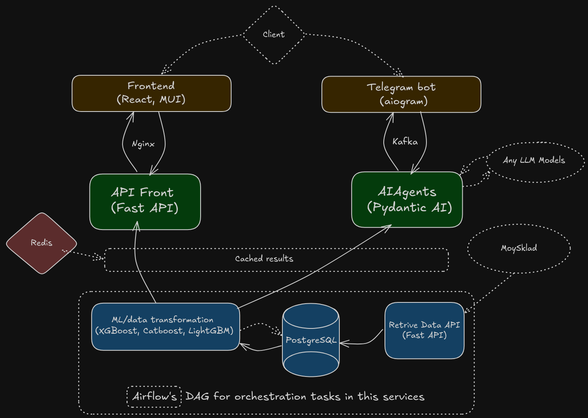

# Project Overview

This project is a distributed system composed of multiple microservices that work together to retrieve, process, analyze, and predict sales and stock data. Clients can use react dashboard or telegram bot with AI Agent system. Below is an overview of the main services and their functionalities.

## Services Architecture



### 1. **Data Retrieve Service** [(source)](DataRetriveService/README.md)
- **Purpose**: Fetches data from external APIs (Moysklad) and stores it in PostgreSQL
- **Key Features**:
  - API integration with Moysklad
  - Data validation and transformation pipelines
  - Async database operations with SQLAlchemy
  - Alembic migrations

### 2. **ML Models Service** [(source)](MLModelsService/README.md)
- **Purpose**: Provides predictive analytics and recommendations
- **Core Components**:
  - Sales forecasting models
  - Stock prediction models with confidence intervals
  - Goods recommendation system (collaborative filtering)
  - Model visualization and evaluation
- **Comments**:
 - The main approach to select ML models for forecasting sales or stock is: build different data sets (with different features) -> test the chosen algorithm on these sets -> select the best one -> tune the best model -> repeat these steps on other models. On CPU this will take 30-180 min of training (revenue preds), but on stock preds this aproach on CPU will take too much time (multi-variable preds), beacuse of that i use only 1 model to predict.Then compare the results of the models with the ensemble and select the best solution. In this project i used (XGBoost, LightGBM, Catboost). Usually the best results was on  XGBoost or LightGBM. CatBoost maby not good fit for this type of data (lack of categorical data in my case)

### 3. **Data API Service** [(source)](DataAPIService/README.md)
- **Purpose**: Serves processed data to frontend and other services
- **Features**:
  - JWT authentication
  - Redis caching
  - Statistical endpoints (agent types, item categories, city data)
  - Integration with ML models

### 4. **Airflow Service** [(source)](AirflowService/README.md)
- **Purpose**: Orchestrates data pipelines and ML workflows
- **Key DAGs**:
  - Data synchronization
  - Model retraining
  - Report generation

### 5. **Telegram Bot Service** [(source)](TelegramBotService/README.md)
- **Features**:
  - AI-powered chat interface
  - Kafka integration for async processing
  - Custom filters and middleware
  - Markdown report generation

### 6. **Dashboard Frontend Service** [(source)](DashboardFrontendService/README.md)
- **Components**:
  - Interactive data grids (MUI DataGrid)
  - Nivo charts for visual analytics
  - Role-based navigation
  - Real-time data updates

### 7. **AI Agent Service** [(source)](AiAgentDataService/README.md)
- **Architecture**:
  - Question decomposition agent
  - Data retrieval agent
  - Analytical agent
  - Summary generation agent
  - Pydantic AI integration
- **Observations**:
  The current configuration of a set of several agents does not allow Deepseek to fall into an infinite loop or cause "Unexpected behavior", which is a known issue at the moment [(src)] (https://api-docs.deepseek.com/guides/function_calling). However, this causes additional execution time, which is far from ideal in the current implementation (simple question takes 2-3 minutes). Perhaps this will not happen with using other models. It is also possible that for "simple" tasks in some agents it is worth using lighter models. But briefly testing on local models (1.5B - 7B) using ollama did not give sufficient results in speed and quality.

## Cross-Service Features
1. **Data Flow**:
   - Moysklad → Data Retrieve → PostgreSQL → ML Models → Redis → Frontend
2. **Cache Layers**:
   - Redis for frequent queries
   - In-memory caching for ML predictions
3. **Monitoring**:
   - Custom logging with Logfire
4. **Security**:
   - JWT token validation
   - Input sanitization

### Installation

1. **Clone the repositories**

2. **Start the services**:
   ```bash
   docker compose up --build
   ```
**Some comments before install**:
  - Create a.env file with all the necessary settings to run doker-compose.
  - The frontend does not use any users database. DataAPIService takes data simply from dict.
  - To get forecast data, you need to run the model at least once. A pickle file will be created, which will be used inside endpoints
  - You need to create the necessary connections for work through the AirFlow frontend ([(source)](AirflowService/README.md))


### Points to improve
There are a huge number of potential improvement points in the current configuration, in each of the microservices. Some of the technologies used may seem redundant, but you can considering this repo as a good platform for further development.

## License
This project is licensed under the MIT License - see the [LICENSE](LICENSE) file for details.